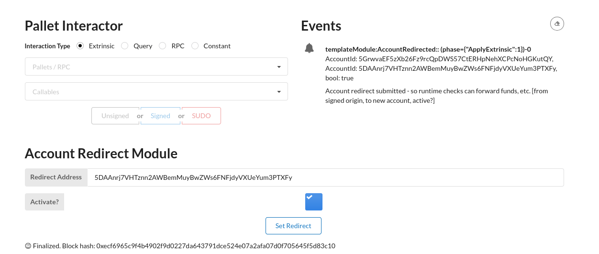

# Substrate Front End Template w/ New Storage Item

## Added `pallets` folder with edits to the node template's provided pallet

Modified base node in it's `pallets/template/src/lib/rs` to store a custom struct `AccountRedirect`. (to compile full node template, just swap this file/entire folder in on the [default node template](https://github.com/substrate-developer-hub/substrate-node-template))

## Added new react component `RedirectMod`

Able to store a new `AccountRedirect` item via GUI. Based on [default node FE template](https://github.com/substrate-developer-hub/substrate-front-end-template)

## Proof of functionality

